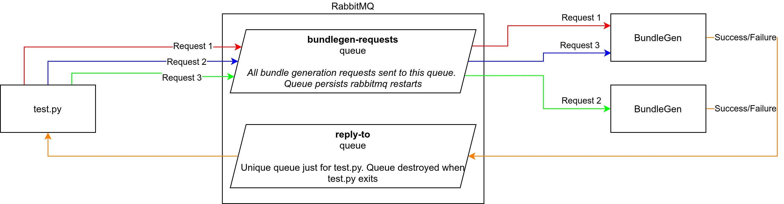

# RabbitMQ Implementation
A RabbitMQ front-end to BundleGen.

## Architecture


### Terminology
* Client - the application sending requests to BundleGen
* Server - BundleGen instance(s)

### Design
* Requests for Bundle generation are sent by the client to the `bundlegen-requests` queue, where BundleGen server instances are listening for messages.
    * Messages are sent in msgpack format
* When BundleGen has completed bundle generation:
    * If success - BundleGen will save the resulting `tar.gz` in it's output directory and send a success message containing the bundle filepath over the `reply-to` queue back to the requestor
    * If failure, BundleGen will send a failure message over the `reply-to` queue

The reply-to queue is a temporary queue generated by RabbitMQ that exists for the lifecycle of the client. Each client gets a unique reply-to queue so that BundleGen always sends the success/failure message back to the client that requested it. https://www.rabbitmq.com/direct-reply-to.html

### Message Format
Messages should be sent in msgpack format.

The bundle generation request should contain the following files (see `message.py`)
```
uuid: str
platform: str
image_url: str,
app_metadata: dict,
lib_match_mode: "normal"|"image"|"host"
```

BundleGen will respond with the following message on success/failure
```
success: bool
uuid: string
bundle_path: string [only if success == true]
```

### Usage
Install BundleGen as normal:
```
pip install -r requirements.txt
pip install --editable .
```

Create a `.env` file in this directory using `sample.env` as an example.

Run `bundlegen-rabbitmq start`
```
bundlegen-rabbitmq -v start
2021-07-06 12:22:31.666 | INFO     | bundlegen.rabbitmq.main:start:262 - Starting RabbitMQ BundleGen consumer. . .
2021-07-06 12:22:31.686 | INFO     | bundlegen.rabbitmq.main:start:282 - Connected to RabbitMQ broker. Waiting for messages. . .
```

View `bundlegen-rabbitmq --help` for all available options

### Configuration
`bundlegen-rabbitmq` reads some settings either from environment variables or a `.env` file.

See `sample.env` for an example `.env` file.

## Docker Container
See the `<repo-root>/docker/rabbitmq/` directory for a Dockerfile that can be used to run
RabbitMQ and BundleGen.